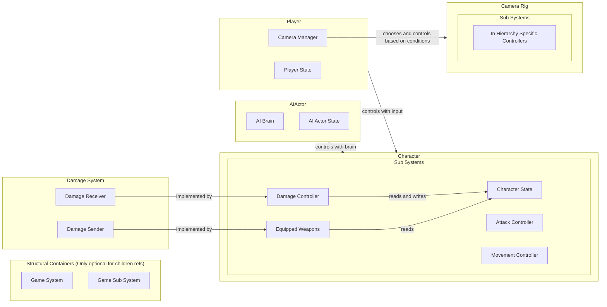

```mermaid
flowchart LR
    
    subgraph structContainers["Structural Containers (Only optional for children refs)"]
        gameSystem[Game System]
        subSystem[Game Sub System]
        
    end
    
    subgraph Damage System
        damageSender[Damage Sender]
        damageReceiver[Damage Receiver]
    end
    
    subgraph Character
        subgraph Sub Systems
            characterState[Character State]
            damageController[Damage Controller]
            attackController[Attack Controller]
            equippedWeapon[Equipped Weapons]
            movementController[Movement Controller]
            
            equippedWeapon --reads-->characterState
            damageController --reads and writes--> characterState
        end
    end
    
    subgraph camRig[Camera Rig]
        subgraph Sub Systems 
            extraControl[In Hierarchy Specific Controllers]
        end
    end
    
    subgraph Player
        playerState[Player State]
        cameraManager[Camera Manager]
    end
    
    subgraph AIActor
        aiBrain[AI Brain]
        aiState[AI Actor State]
    end

    cameraManager --chooses and controls based on conditions--> camRig
    damageReceiver --implemented by--> damageController
    damageSender --implemented by--> equippedWeapon
    Player --controls with input--> Character
    AIActor --controls with brain--> Character
```