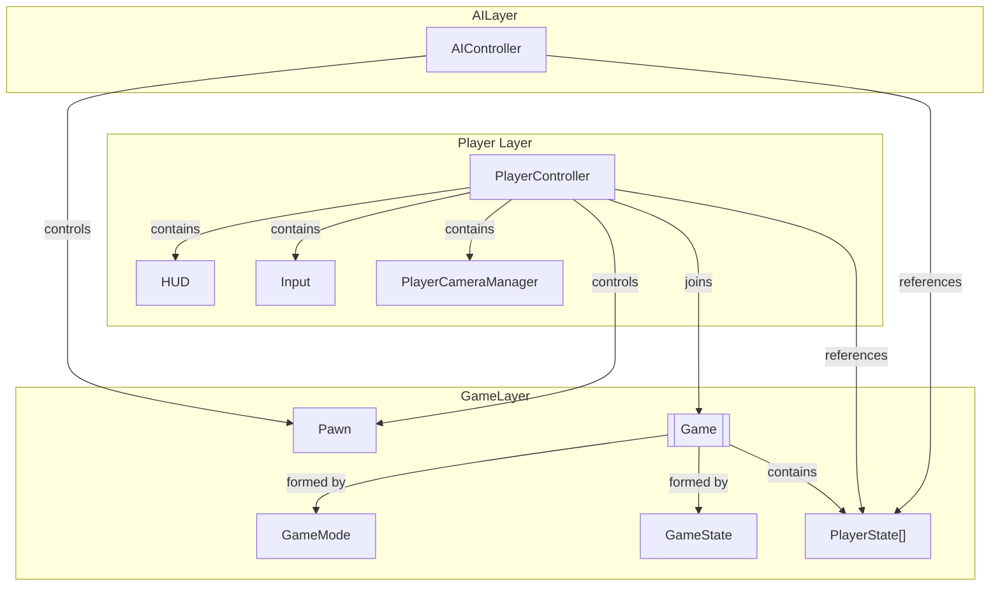

```mermaid
flowchart TB
    subgraph Player Layer
        direction RL
        hud["HUD"]
        input["Input"]
        cameraManager["PlayerCameraManager"]
        playerController --contains--> hud
        playerController --contains--> input
        playerController --contains--> cameraManager
        playerController["PlayerController"]

        click cameraManager callback "Handles camera blends and POV switches"
        click input callback "Handles input action abstraction and decoupling"
        click hud callback "Handles Overlay UI logic and navigation"
        click playerController callback "Represents a real physical player and controls pawns"
    end
    subgraph AILayer
        aiController["AIController"]
        
        click aiController callback "Emulates a 'fictional' player to control pawns"
    end
    subgraph GameLayer
            pawn["Pawn"]
            game[["Game"]]
            gameMode["GameMode"]
            gameState["GameState"]
            playerState["PlayerState[]"]

            game --formed by--> gameMode
            game --formed by--> gameState
            game --contains--> playerState
            playerController --joins---> game
            aiController --controls--->pawn
            playerController --controls-->pawn
            playerController --references--> playerState
            aiController --references-----> playerState
            click pawn callback "Represents controllable actors in the game world, can be controlled by AI or Humans"
            click game callback "Abstract representation formed by GameMode and GameState"
            click gameMode callback "Defines the game at its core concepts, like rules or mechanics (server only)"
            click gameState callback "Holds global information about the game such as How many sidequests have been completed or a list of the connected players"
            click playerState callback "Holds specific data for each player such as their score, their health"
    end
    
    

    

```